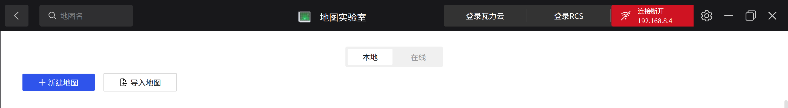
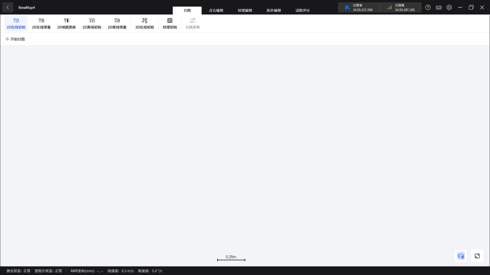
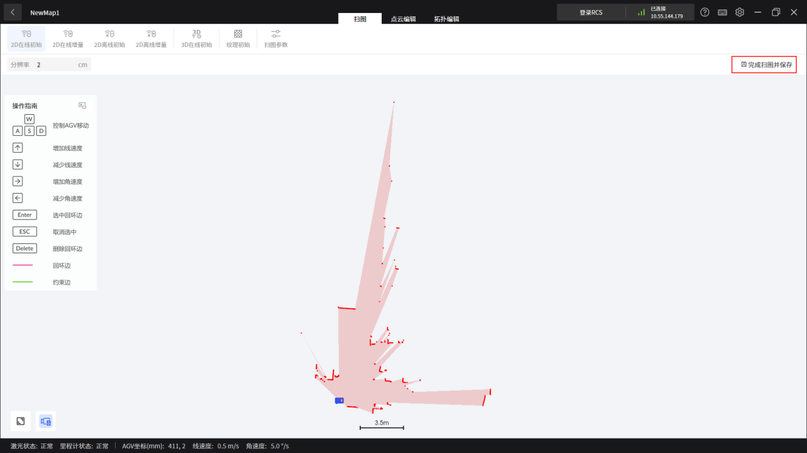
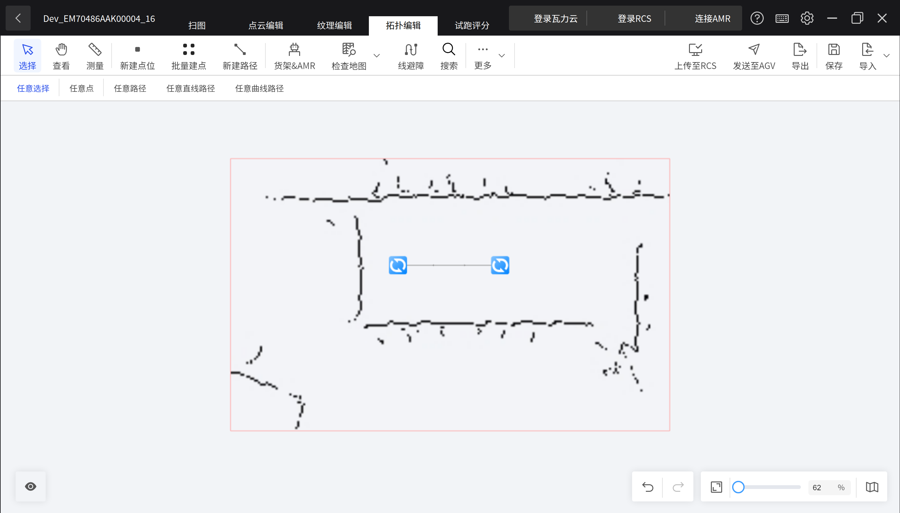
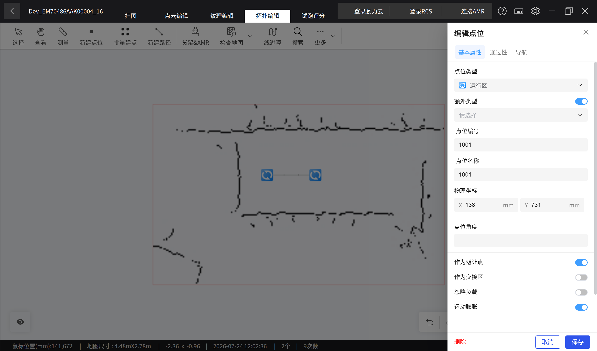
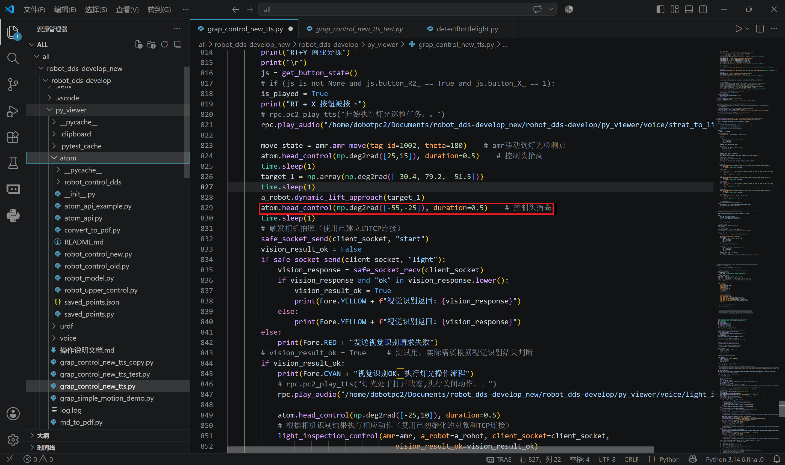
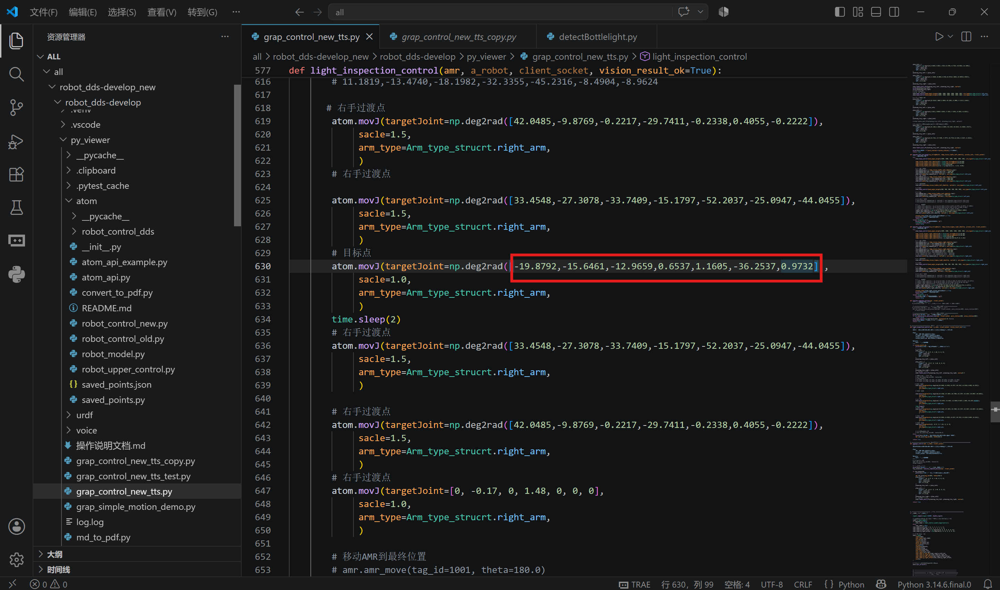

# DOBOT ATOM-W 轮式人形机器人灯光识别开发指南

版本：V1.0  
日期：2026-07-27  

---

## 1. 文档目标

本文档用于指导在 DOBOT ATOM-W 轮式人形机器人上完成灯光识别功能的开发与部署，覆盖以下阶段：

1. 登录机器人 PC2 并配置运行环境。
2. 准备 Demo 文件，模型训练。
3. 创建地图并设置起始点与工作点位。
4. 微调机器人动作，确保手臂能够按到开关。
5. 配置视觉检测参数并执行目标检测。

---

## 2. 概述

视觉检测是指通过 ATOM-W 机器人相机等传感器（即图像摄取装置）将拍摄物体转换成图像信号，传送给专用的图像处理系统，根据像素分布和亮度、颜色等信息，转变成数字化信号；图像系统对这些信号进行各种运算来抽取目标的特征，进而根据判别的结果来控制机器人的动作。

ATOM-W 机器人视觉检测基于 YOLO11，支持采集数据、训练和标定、目标检测等视觉任务。

所有运行代码均存储在 PC2 中。

---

## 2.1 准备清单

在开始部署前，请确保已准备好以下设备和软件：

| 类别 | 名称 | 说明 |
|---|---|---|
| 硬件设备 | DOBOT ATOM-W 轮式人形机器人 | 包含机器人本体、控制器等 |
| 硬件设备 | 灯光巡检工作台 | 包含灯泡、开关等检测目标物 |
| 软件工具 | Walle 建图软件 | 用于创建和管理机器人导航地图 |
| 软件工具 | DobotEX-APP | 用于机器人使能、遥控和关节参数查看 |

---

## 3. 配置运行环境

Dobot Atom-W 内置的 PC2 主机默认出厂已经完成运行环境的配置。

### 3.1 登录 PC2

PC2 远程桌面登录方式：

打开远程桌面，输入 ATOM-W 机器人 PC2 的 IP 地址 `192.168.8.13:3390`，在弹出的界面输入用户名（`dobotpc2`）和密码（`123456`）。

### 3.2 安装 YOLO11

机器人视觉检测基于 YOLO11 进行，需配置 YOLO11 环境。推荐使用 GPU 版本进行训练和推理，不建议使用 CPU 进行模型的训练。

### 3.3 配置推理环境

推理环境除了安装 YOLO11 环境外，还需要安装相机的 SDK 以及 opencv 依赖。打开命令窗口，切换到安装的 conda 虚拟环境（执行命令 `conda activate Atom`），执行以下命令：

```bash
# 安装 realsense 相机驱动
pip install pyrealsense2

# 安装 opencv 依赖
pip install opencv-python

# 安装 apriltag 依赖
pip install pupil-apriltags
```

### 3.4 安装 CycloneDDS

基于 PC2 进行上位机控制环境部署，实现 DDS 通讯在 PC2 上运行脚本发送话题消息控制机器。

步骤 1：安装依赖
```bash
pip install cmake
conda install -c conda-forge cyclonedds
```

步骤 2：解压并安装软件包
```bash
# 1. 解压
unzip cyclonedds.zip
cd cyclonedds

# 2. 创建构建目录
rm -rf build
mkdir build
cd build

# 3. 配置 CMake
cmake .. -DCMAKE_INSTALL_PREFIX=$CONDA_PREFIX

# 4. 编译
make -j$(nproc)

# 5. 安装
sudo make install

# 6. 设置环境变量
export CYCLONEDDS_HOME=$CONDA_PREFIX
export CMAKE_PREFIX_PATH=$CONDA_PREFIX:$CMAKE_PREFIX_PATH

# 7. 安装 Python 绑定
pip install cyclonedds==0.10.5 --no-binary cyclonedds
```

### 3.5 安装 LabelImg

参考网上教程下载安装 LabelImg 程序，用于图像标注。

---

## 4. 准备 Demo 文件

### 4.1 训练模型

#### 4.1.1 训练数据准备

步骤 1：使用 pycharm 打开 `yaoshibang` 文件夹，根据"自定义训练步骤"文档进行训练数据处理。

步骤 2：双击打开并修改 `yaoshibang/voc2yolo.py` 文件中相关参数：
- 修改为自定义的物品类型（也是标注时的类型）
- 修改为标注生成的 xml 文件目录
- 修改为训练时的 VOC 数据目录

步骤 3：划分训练集、验证集和测试集，双击打开并修改 `yaoshibang/dataSet.py` 文件中的相关代码。

步骤 4：执行完以上操作，会生成 JPEGImage、labels、VOCdevkit 三个文件夹，内含相应的数据，数据集就制作好了。

#### 4.1.2 训练模型

步骤 1：按照"自定义训练步骤"文档，双击打开并修改 `data.yaml` 文件，修改加载数据集路径、类别数量以及类别。

步骤 2：修改好配置参数后，打开 `yaoshibang/train.py` 文件，确认相关代码路径配置正确。

步骤 3：若没有报错，运行 `yaoshibang/train.py` 文件进行训练。

步骤 4：训练完成后，在 `runs` 文件夹下生成对应的模型文件以及训练情况。

### 4.2 备注

> **注意**：灯光巡检任务的模型已经有训练好的版本，部署时可直接使用已训练的模型文件，无需重新训练。具体模型路径和配置请参考实际代码文件 `yaoshibang/detectBottlelight.py` 中的模型加载路径配置。

---

## 5. 创建地图

### 5.1 操作步骤

（1）打开瓦力建图工具，进入地图实验室，点击新建地图



（2）点击 2D 在线初始 -> 开始扫图



（3）扫图结束后，点击完成扫图并保存。



### 5.2 底盘点位要求

机器居中对齐桌子，底盘距离桌子约 30cm，可自由调整，确保手臂能按到开关，头部转动，相机能够拍到灯泡，机台位于地图左侧。


特别说明：底盘的朝向角度以地图为准，地图的右侧永远是 0°，左侧永远是 180°


（4）在拓扑编辑中选择新建点位，分别为起始点和工作点



（5）将起始点编号设置为 1001，工作点编号设置为 1002



---

## 6. 微调动作

### 6.1 常用命令说明

在巡检案例中使用到了以下命令：

```python
# 角度值转弧度值函数，正常输入关节角度值即可
np.deg2rad()

# 躯干控制
atom.torsor_control(np.deg2rad(0))

# 底盘移动到指定点位
amr.amr_move(tag_id=1001, theta=180.0)

# 头部控制
atom.head_control(np.deg2rad([0,5]), duration=1.0)

# 动态抬起接近目标
target_1 = np.array(np.deg2rad([-30.9,77.9,-51.5]))
a_robot.dynamic_lift_approach(target_1)

# 双臂联合运动
plan_info = {
    "target": np.deg2rad([0,9.74,0,85,0,0,0]),
    "vel": joint_vel,
    "acc": joint_acc,
    "CP": 0 * 0.01,
}
planning_traj_left = [plan_info]

plan_info = {
    "target": np.deg2rad([0,-9.74,0,85,0,0,0]),
    "vel": joint_vel,
    "acc": joint_acc,
    "CP": 0 * 0.01,
}
planning_traj_right = [plan_info]

# 双手同时执行动作
atom.TwoArm_movJ_CP(planning_traj_left, planning_traj_right, scale=1)

# 单臂运动
atom.movJ(targetJoint=np.deg2rad([42.0485,-9.8769,-0.2217,-29.7411,-0.2338,0.4055,-0.2222]),
         scale=1.5,
         arm_type=Arm_type_struct.right_arm)

# 播放音频
rpc.play_audio()
```

### 6.2 操作步骤

**步骤 1**：通过 APP 给机器上使能，在没有报警的状态下，APP 左上角会显示上使能按钮，若有报警，需要先清除报警才会显示


**步骤 2**：点击"进入遥控"，将机器切换至运动状态，或者使用手柄进行切换，手柄切换顺序图如下


**步骤 3**：通过建图软件，控制底盘运动到检测点


**步骤 4**：通过手柄控制机器升降，将机器升到合适的高度，确保手臂能够以比较自然的姿态按到按钮即可

| 运动状态 | 操作说明 |
|---|---|
| 下肢 | RB + 方向键控制升降以及前后移动（限速 0.05m/s） |
| 底盘 | 摇杆控制移动 |
| 左摇杆 | 前后移动（限速 0.6 m/s） |
| 右摇杆 | 左右旋转（限速 1 rad/s） |


**步骤 5**：打开 APP -> 设备 -> 关节设置 -> 关节信息 -> 位置，查看升降轴的关节角度，此时，该关节角度位置，为灯光检测时的升降轴的位置，控制升降轴运动到这个位置之后，才可以进行灯光检测


**步骤 6**：打开脚本 `robot_dds-develop_new/robot_dds-develop/py_viewer/grap_control_new_tts.py`，找到对应的升降控制命令，填写关节值


**步骤 7**：通过手柄或者 APP，将机器切换至调试模式，运行脚本 `robot_dds-develop_new/robot_dds-develop/py_viewer/atom/robot_control_new.py`，运行后会弹出一个上位机界面，可以对 Atom 上肢进行点动以及截取点位坐标信息。


**步骤 8**：在头部角度控制位置手动输入角度值，点击 command，头会运动到指定角度，同时，运行打开视觉脚本 `yaoshibang/detectBottlelight.py`，填写相机序列号，并运行该脚本，会弹出相机画面


**步骤 9**：查看相机画面，检测灯泡是否在相机视野内（尽量居中），若不在相机视野内，继续手动调整头部的角度


**步骤 10**：将头部的关节角度，填入到脚本 `robot_dds-develop_new/robot_dds-develop/py_viewer/grap_control_new_tts.py` 中对应的位置



**步骤 11**：点动右臂，调整手臂的位置，使之能够按开关并把开关关闭（可以先调节关节 1-7 粗调姿态，再调节 xyz 精调位置）


**步骤 12**：将此刻的右臂关节值，记录下来，填写到脚本 `robot_dds-develop_new/robot_dds-develop/py_viewer/grap_control_new_tts.py` 对应的位置



**步骤 13**：根据底盘的地图点位编号，修改脚本的点位编号和角度

至此，所有关键点位的调整已完成，可根据自身需求，增加或减少过渡点位。

---

## 7. 目标检测

### 7.1 参数配置

检测程序为 `yaoshibang` 文件夹下的 `detectBottlelight.py`，在进行检测测试前，需要确认参数是否正确：

| 参数 | 说明 | 示例 |
|---|---|---|
| `model` | YOLO 模型路径 | `YOLO('./runs/best_yaoshibang.pt')` |
| `SECOND_CAMERA_SERIAL` | 相机 SN 码 | `"241122303389"` |
| `brightness_threshold` | 灯光亮度检测阈值 | 220（出现误检测可调整） |
| `min_area` | 最小检测面积 | 根据实际场景调整，过滤过小的检测目标 |
| `max_area` | 最大检测面积 | 5000（过滤过大的检测目标，避免误识别） |


启用鼠标框选功能，通过鼠标框选检测区域


**调试建议**：
- 若出现误检测，可调整 `brightness_threshold`（灯光亮度检测阈值）、`min_area`（最小检测面积）和 `max_area`（最大检测面积）参数。
- 调试时，可以适当放宽这些阈值和范围，获得多个检测目标，根据终端输出的目标信息进行筛选，进一步精确调整参数。
- `min_area` 用于过滤过小的检测目标，`max_area` 用于过滤过大的检测目标，合理设置可有效减少误识别。


### 7.2 运行步骤

**步骤 1**：运行检测逻辑程序 `robot_dds-develop_new/robot_dds-develop/py_viewer/grap_control_new_tts.py`，使机器运动到检测点位，并抬头看向灯泡，然后停止程序。

**步骤 2**：在命令行中激活 Conda 环境：
```bash
conda activate Atom
```

**步骤 3**：运行 `yaoshibang/detectBottlelight.py` 程序，当出现显示图像窗口后，点击键盘上的"L"键进入目标框选状态，通过鼠标框选目标检测区域，视觉只会对框选的区域内进行检测，可避免误识别


### 7.3 自动检测

开启自动检测时，先运行程序 `yaoshibang/detectBottlelight.py`，再运行程序 `robot_dds-develop_new/robot_dds-develop/py_viewer/grap_control_new_tts.py`。

---

## 8. 关键文件索引

| 文件路径 | 作用 |
|---|---|
| `robot_dds-develop_new/robot_dds-develop/py_viewer/grap_control_new_tts.py` | 机器人动作控制主脚本，包含升降、头部、手臂关节控制 |
| `robot_dds-develop_new/robot_dds-develop/py_viewer/atom/robot_control_new.py` | Atom 上肢点动控制与点位坐标截取 |
| `yaoshibang/detectBottlelight.py` | 目标检测主程序，基于 YOLO11 |
| `yaoshibang/detectBottlelight1.py` | 灯光检测脚本（备用） |
| `yaoshibang/sn.py` | 相机序列号检测脚本 |
| `yaoshibang/voc2yolo.py` | VOC 格式转 YOLO 格式脚本 |
| `yaoshibang/dataSet.py` | 数据集划分脚本 |
| `yaoshibang/train.py` | 模型训练脚本 |

---

## 9. 最小验收清单

部署完成前，逐项确认：

1. 能够成功登录 PC2 远程桌面。
2. YOLO11 环境已安装配置完成。
3. 推理环境依赖（pyrealsense2、opencv-python、pupil-apriltags）已安装。
4. CycloneDDS 已安装配置完成。
5. 已创建地图并设置起始点（1001）和工作点（1002）。
6. 机器人能够运动到检测点位并调整到合适高度。
7. 头部角度已调整，相机能够拍到灯泡（尽量居中）。
8. 右臂关节值已记录，能够按到开关。
9. 检测程序参数配置正确（模型路径、相机序列号）。
10. 能够通过鼠标框选检测区域。
11. 自动检测流程能够正常运行。